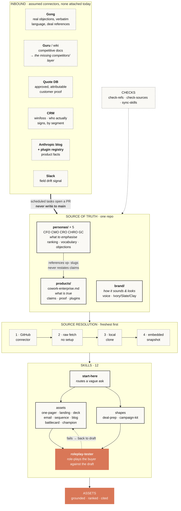

# Architecture

## Why it's built this way

**Three layers, with precedence.** `products/` wins on *what is true*, `personas/`
on *emphasis*, `brand/` on *register* — except where a persona's vocabulary
overrides it. Without a stated order, two files disagree and the answer depends
on which the model read first.

**Personas reference claims, they don't restate them.** Each cites value props by
slug (`vp-coverage`). Copy the claim into five persona files and someone edits
the product file in March; by June the personas quietly contradict it. Slugs mean
a reworded claim can't drift, and reordering the product file can't silently
break a persona.

**Role is a property of the deal, not the person.** The same CMO is the economic
buyer for a departmental purchase and a champion in a company-wide rollout, and
those need differently shaped assets. Personas declare `roles_by_motion`, and the
motion changes the ranking — `vp-coverage` leads for a CFO enterprise-wide and
comes **last** for a CMO buying for forty people. Same three claims, four
different orders. That inversion is the system's whole output.

**Source resolution degrades, and says so.** Connector → raw fetch → local clone
→ embedded snapshot, stopping at the first that works. The snapshot is the floor,
so a skill always works with zero setup; every skill reports which source it used,
because "read live" and "snapshot from six weeks ago" mean different things to
whoever relies on the output.

## What keeps it trustworthy

Trust here means *an asset says only what the repo can support*. Five mechanisms,
and the point of all of them is that a person who has never read this document
still can't produce an ungrounded claim.

| | |
|---|---|
| **`check-refs.py`** | Fails if a persona cites a value prop slug that doesn't exist. The link to the foundation can't silently rot. |
| **`check-sources.py`** | Fails on any figure without a citation nearby. It found nine uncited blocks on first run, including one in a file I'd assumed was clean. |
| **`sync-skills.py`** | Fails if the two skill copies diverge. Where duplication is unavoidable, it's enforced rather than remembered. |
| **`roleplay-tester`** | Six PASS/FAIL checks — value prop order *for the stated motion*, banned vocabulary, proof traceability, invented claims, status flagging, motion fit — then role-plays the buyer to test the draft. Anyone can run it without me. |
| **Source tiers** | First-party Anthropic > independent research > aggregated write-ups > practitioner accounts. Every figure names its tier. Where only a weak tier exists, claims are stated directionally — the direction is reliable, the decimal places aren't. |

Four rules sit above those, all learned by getting them wrong first:

- **Never write down an unverified number**, even labelled "do not use" — the
  number outlives the label.
- **Don't propagate a competitor's factual claims or benchmark figures.**
- **Single sources inform a point of view; they don't establish a claim.**
- **Adoption data is an existence proof, not a profile.** Never imply a buyer is
  behind their peers.

**Gaps are surfaced, not filled.** `TODO(source)` and `SYNTHETIC` mean content is
missing; skills report them instead of improvising. The CFO file carries a
**blocking** gap — no pricing — and every CFO asset says so rather than
estimating. A stated gap is the system working.

## What isn't here

**No generated assets.** The repo is the backend. A seller asks in Cowork, the
asset appears in the conversation, and they use it where they work — it is never
written back. Committing output would put a copy where a pointer belongs, and a
copy goes stale with nothing to catch it.

The one build artifact that *is* committed is `dist/cowork-positioning.zip`,
which is the system packaged for the zero-setup path — a release of the thing,
not output from it.

## Staying current

**Assumed connectors, none attached today.** Named so the design is checkable
rather than aspirational — and matched to the *kind* of staleness each can
actually catch. A web search will never find a customer quote sitting in a sales
call; a call recorder will never tell you a competitor shipped the same feature.

| Source | Catches | Feeds |
|---|---|---|
| **Gong** | Real objections and the words buyers actually use | `personas/*` objections and vocabulary |
| **Guru** or a wiki | Competitor moves and positioning | the missing `competitors/` layer |
| **Quote database** | Approved, attributable customer proof | `products/` proof points |
| **CRM** | Win/loss, and who really signs by segment | `roles_by_motion` — currently inferred, not observed |
| **Anthropic blog + plugin registry** | New capability, new plugins, benchmark claims | `products/` claims and roster |
| **Slack** | Reps noticing the file is wrong before it costs a deal | flags for the owner |

`refresh-tasks.md` already specifies three of these at three cadences: proof
points monthly, competitive quarterly, drift weekly.

### One update, traced end to end

The sales proof point in `products/` is **108 days old** — past the 90-day
ceiling, and flagged stale in every asset that uses it. Here is that flag
clearing:

1. **Monthly task queries Gong** for recent calls where a customer describes a
   Cowork outcome, and the quote database for anything newly approved.
2. **It finds a dated, attributable one** — and if it doesn't, it says so and
   changes nothing. No task is allowed to invent a proof point.
3. **It opens a pull request** against `products/cowork-enterprise.md`,
   replacing the stale entry and updating the freshness note.
4. **CI runs the three checks.** `check-sources.py` fails the PR if the new
   entry carries no citation. This is the load-bearing step: it means a bad
   update cannot merge even if nobody reads it carefully.
5. **A human merges it.** Automating the check is safe; automating the judgment
   about what counts as on-positioning is exactly what a person should keep.
6. **Every persona picks it up with no edit.** They reference rather than copy,
   so nothing downstream had to know this happened.
7. **The bundle rebuilds** on merge. Live sources are already current; the
   snapshot catches up within minutes rather than months.
8. **The next asset cites the new proof point**, and the stale warning stops
   appearing — because the condition that produced it is gone, not because
   someone silenced it.

**Nothing in that chain writes to `main`.** Every path in is a pull request or an
issue. That is the single most important property here: the system can gather
evidence continuously and still cannot change the positioning on its own.

### The same trace, starting from a persona

An update can also start downstream. A rep reports in Slack that CFOs keep
raising a consumption-cost objection the file doesn't cover. The weekly task
flags it; someone adds it to `personas/cfo/README.md` with its source and
confidence tier. No product claim changed, so `products/` is untouched — but
every CFO asset generated afterwards pre-empts that objection, and `deal-prep`
starts briefing sellers on it.

The layers move independently. That is what the precedence rule buys.

`pricing/cowork-enterprise.md` now holds the *shape* of the CFO answer — the
per-seat-versus-run-rate comparison, the threshold question, and the consumption
question that matters more than list price for a buyer measured on forecast
accuracy. Every figure in it is a bracketed placeholder marked `SYNTHETIC`, so
assets still say terms are unavailable. **The structure is real and the numbers
are not, and the file says which** — that is the honest state, and it is better
than either an empty gap or an invented figure.

What I'd add next, in order: real commercial terms replacing those placeholders,
a `competitors/` layer (no named-competitor battlecard can be built without it),
and CI running the three checkers plus a bundle rebuild on every merge.
