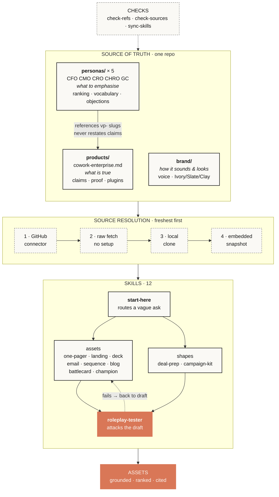

# Architecture

## Why it's built this way

**Three layers, with precedence.** `products/` wins on *what is true*, `personas/`
on *emphasis*, `brand/` on *register* — except where a persona's vocabulary
overrides it. Without a stated order, two files disagree and the answer depends
on which the model read first.

**Personas reference claims, they don't restate them.** Each cites value props by
slug (`vp-coverage`). Copy the claim into five persona files and someone edits
the product file in March; by June the personas quietly contradict it. Slugs mean
a reworded claim can't drift, and reordering the product file can't silently
break a persona.

**Role is a property of the deal, not the person.** The same CMO is the economic
buyer for a departmental purchase and a champion in a company-wide rollout, and
those need differently shaped assets. Personas declare `roles_by_motion`, and the
motion changes the ranking — `vp-coverage` leads for a CFO enterprise-wide and
comes **last** for a CMO buying for forty people. Same three claims, four
different orders. That inversion is the system's whole output.

**Source resolution degrades, and says so.** Connector → raw fetch → local clone
→ embedded snapshot, stopping at the first that works. The snapshot is the floor,
so a skill always works with zero setup; every skill reports which source it used,
because "read live" and "snapshot from six weeks ago" mean different things to
whoever relies on the output.

## What keeps it trustworthy

Trust here means *an asset says only what the repo can support*. Five mechanisms,
and the point of all of them is that a person who has never read this document
still can't produce an ungrounded claim.

| | |
|---|---|
| **`check-refs.py`** | Fails if a persona cites a value prop slug that doesn't exist. The link to the foundation can't silently rot. |
| **`check-sources.py`** | Fails on any figure without a citation nearby. It found nine uncited blocks on first run, including one in a file I'd assumed was clean. |
| **`sync-skills.py`** | Fails if the two skill copies diverge. Where duplication is unavoidable, it's enforced rather than remembered. |
| **`roleplay-tester`** | Six PASS/FAIL checks — value prop order *for the stated motion*, banned vocabulary, proof traceability, invented claims, status flagging, motion fit — then attacks the draft in character. Anyone can run it without me. |
| **Source tiers** | First-party Anthropic > independent research > aggregated write-ups > practitioner accounts. Every figure names its tier. Where only a weak tier exists, claims are stated directionally — the direction is reliable, the decimal places aren't. |

Four rules sit above those, all learned by getting them wrong first:

- **Never write down an unverified number**, even labelled "do not use" — the
  number outlives the label.
- **Don't propagate a competitor's factual claims or benchmark figures.**
- **Single sources inform a point of view; they don't establish a claim.**
- **Adoption data is an existence proof, not a profile.** Never imply a buyer is
  behind their peers.

**Gaps are surfaced, not filled.** `TODO(source)` and `SYNTHETIC` mean content is
missing; skills report them instead of improvising. The CFO file carries a
**blocking** gap — no pricing — and every CFO asset says so rather than
estimating. A stated gap is the system working.

## What isn't here

**No generated assets.** The repo is the backend. A seller asks in Cowork, the
asset appears in the conversation, and they use it where they work — it is never
written back. Committing output would put a copy where a pointer belongs, and a
copy goes stale with nothing to catch it.

The one build artifact that *is* committed is `dist/cowork-positioning.zip`,
which is the system packaged for the zero-setup path — a release of the thing,
not output from it.

## Staying current

An edit to `products/` reaches everything downstream without touching another
file. Replace a stale proof point and every persona picks it up, because they
reference rather than copy. Reorder value props and nothing breaks, because slugs
travel with the claim. Rename one and `check-refs` fails loudly.

The staleness that matters isn't the file, it's the *evidence*. Proof points
carry a 90-day ceiling and skills flag anything past it — two entries are flagged
stale today rather than quietly used. `refresh-tasks.md` specifies three
scheduled checks at three cadences: proof points monthly, competitive positioning
quarterly, internal drift weekly. **None of them writes to `main`** — automating
the check is safe; automating the judgment about what counts as on-positioning is
exactly what a human should keep.

What I'd add next, in order: a `pricing/` layer (the blocking gap), a
`competitors/` layer (no named-competitor battlecard can be built without it),
and CI running the three checkers plus a bundle rebuild on every merge.
